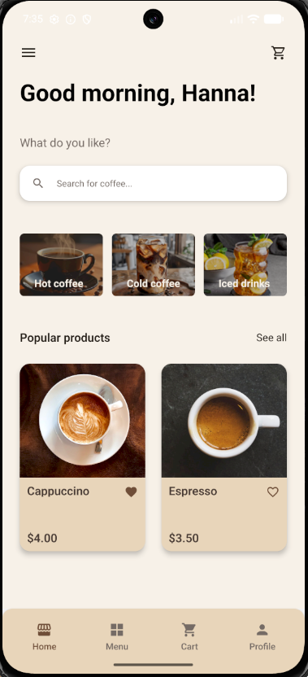
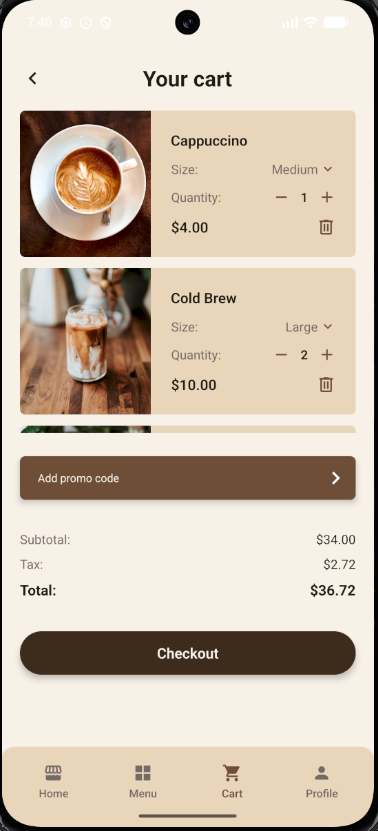
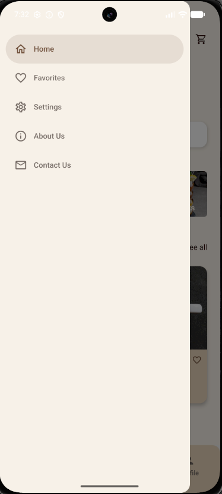
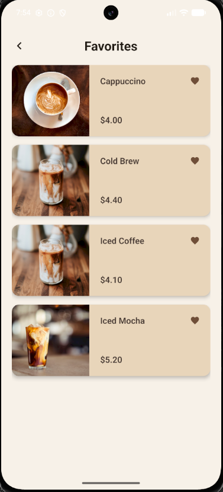
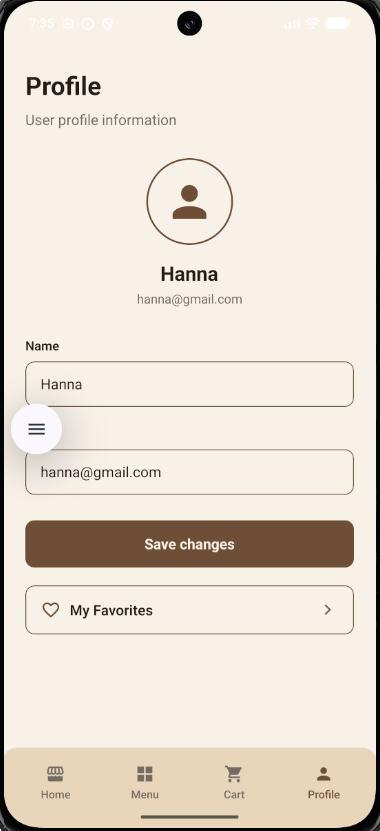

# Cross Assignment 6

## Description

CoffeeToGo is a React Native coffee shop application.

The application uses Stack Navigator, Bottom Tab Navigator, and Drawer Navigator for navigation. Product data is loaded from a REST API using the Fetch API and displayed dynamically throughout the application.

This version of the project focuses on global state management using Context API and Redux Toolkit.

Context API is used to manage user profile information across different screens. Redux Toolkit is used to manage the shopping cart and favorite products.

The project also includes REST API integration, product filtering, search, cart management, favorites, product details, and checkout functionality.

## Global State Management

The application uses two approaches for global state management:

- Context API — user profile data
- Redux Toolkit — shopping cart and favorite products

### Context API

User profile information is managed using `UserContext`.

The context stores:

- User name
- User email

`UserProvider` wraps the application and provides the user state and the `updateUser` function to other components.

The Profile screen allows the user to update profile information. The updated name is also displayed on the Home screen.

This demonstrates sharing and updating global state between multiple components using Context API.

### Redux Toolkit

Redux Toolkit is used to manage the shopping cart and favorite products.

The Redux store contains:

- `cart`
- `favorites`

The application uses:

- `configureStore`
- `createSlice`
- `Provider`
- `useSelector`
- `useDispatch`

### Cart State

The cart is managed through `cartSlice`.

Available cart operations include:

- Add a product
- Remove a product
- Update product quantity
- Update selected product size
- Update the price when the selected size changes
- Calculate subtotal, tax, and total

Cart state is shared between the Coffee Details, Cart, and Checkout screens.

### Favorites State

Favorite products are managed through `favoritesSlice`.

Users can:

- Add a product to favorites
- Remove a product from favorites
- See the active favorite state using a filled heart icon
- Access favorite products from the Favorites screen

Favorite state is synchronized across multiple screens, including:

- Home
- Menu
- Category Products
- Popular Products
- Coffee Details
- Favorites

The Favorites screen can be accessed from the Drawer menu and from the Profile screen.

## Navigation Structure

The application uses several navigation types:

- Stack Navigator
- Bottom Tab Navigator
- Drawer Navigator

Navigation structure:

```text
Welcome
↓
Drawer Navigator
├── Home
│   └── Bottom Tab Navigator
│       ├── Home Stack
│       │   ├── Home
│       │   ├── Popular Products
│       │   ├── Category Products
│       │   └── Coffee Details
│       ├── Menu Stack
│       │   ├── Menu
│       │   ├── Category Products
│       │   └── Coffee Details
│       ├── Cart Stack
│       │   ├── Cart
│       │   └── Checkout
│       └── Profile
├── Favorites
├── Settings
├── About Us
└── Contact Us
```

## Features

- Welcome screen
- Home screen
- User profile
- Editable user name and email
- Global user state with Context API
- Coffee menu
- Coffee details
- REST API integration
- Product data loading from MockAPI
- GET requests using Fetch API
- Products displayed using FlatList
- Loading indicator while fetching data
- Error handling for failed API requests
- Popular products
- Product filtering by category
- Search filtering on category and popular product screens
- Hot, Cold, and Iced coffee categories
- Navigation from categories to filtered product lists
- Navigation from product lists to Coffee Details
- Remote product images loaded from API
- Product size selection
- Different prices for Small, Medium, and Large drinks
- Product quantity selection
- Global cart state with Redux Toolkit
- Add products to cart
- Remove products from cart
- Update product quantity in cart
- Update product size in cart
- Cart subtotal, tax, and total calculation
- Favorites management with Redux Toolkit
- Add and remove favorite products
- Synchronized favorite state across screens
- Favorites screen
- Checkout screen
- Bottom Tab navigation
- Drawer navigation
- Stack navigation
- Custom navigation headers
- Navigation icons
- Back navigation
- Drawer swipe gesture
- Product ID and product data passing between screens

## API Integration

Product data is loaded from a REST API provided by MockAPI.

The API URL is stored in an environment variable and is not committed directly to the repository.

The API request logic is separated into:

```text
src/api/api.js
```

Products are loaded using a GET request with the Fetch API:

```js
import { API_URL } from '@env';

// GET request to load all coffee products from MockAPI
export const fetchProducts = async () => {
  const response = await fetch(API_URL);

  if (!response.ok) {
    throw new Error('Failed to fetch products');
  }

  const data = await response.json();

  return data;
};
```

The received data is stored in component state using `useState`.

`useEffect` is used to load products when the relevant screen is opened.

## Context API Structure

The user context is located in:

```text
src/context/UserContext.jsx
```

`UserContext` provides global user information and a function for updating it.

The context is used by multiple screens, including:

- Profile
- Home

This allows profile information changed on the Profile screen to be immediately available on the Home screen.

## Redux Structure

Redux-related files are separated into:

```text
src/redux/
├── store.js
├── cartSlice.js
└── favoritesSlice.js
```

The Redux store is configured using `configureStore`.

The application is wrapped with the Redux `Provider`, allowing screens and components to access global Redux state.

`useSelector` is used to read state, while `useDispatch` is used to dispatch Redux actions.

## Product List

Products received from the API are displayed using React Native `FlatList`.

The product list uses:

- `data` for API products
- `renderItem` to render product cards
- `keyExtractor` for list item keys
- `HorizontalProductCard` as a reusable custom component
- `VerticalProductCard` for product presentation on the Home screen

Dynamic data and favorite state are passed to reusable product cards through props.

Each product can be selected to open the Coffee Details screen.

## Loading and Error Handling

While product data is being loaded, the application displays an `ActivityIndicator`.

If the API request fails, the application displays:

```text
Failed to load products
```

This prevents the application from crashing when the API or network is unavailable.

## Data Passing

When a product is selected, its ID and product data are passed to the Coffee Details screen:

```js
navigation.navigate(SCREENS.COFFEE_DETAILS, {
  productId: item.id,
  product: item,
});
```

The product data is received on the Coffee Details screen using route parameters:

```js
const { product } = route.params || {};
```

If product data is missing, the application displays:

```text
Product not found
```

instead of crashing.

## Technologies

- React Native
- JavaScript
- React Navigation
- Native Stack Navigator
- Bottom Tab Navigator
- Drawer Navigator
- Context API
- Redux Toolkit
- React Redux
- Fetch API
- MockAPI
- React Native Vector Icons
- React Native Safe Area Context
- react-native-dotenv

## Testing

The application was tested on an Android emulator.

The following functionality was tested:

- Context API user state
- Updating user profile information
- Sharing user information between Profile and Home
- Redux store integration
- Adding products to cart
- Removing products from cart
- Updating product quantity
- Updating product size
- Cart calculations
- Adding products to favorites
- Removing products from favorites
- Favorite state synchronization between screens
- Favorites navigation
- REST API product loading
- Loading state
- API error handling
- Product rendering with FlatList
- Navigation between screens
- Bottom Tab navigation
- Drawer navigation
- Drawer swipe gesture
- Stack navigation
- Back navigation
- Product ID and data passing
- Category filtering
- Popular products
- Product search
- Remote API images
- Coffee size selection
- Price changes depending on drink size
- Checkout flow

The project was checked with ESLint with no errors or warnings.

`SafeAreaView` is used to support different screen areas and system UI.

## Screenshots

### Welcome Screen


### Home Screen — Context API

The Home screen displays the user name received from `UserContext`.



### Menu Screen


### Coffee Categories


### Coffee Categories Search


### Coffee Details


### Cart — Redux

The Cart screen demonstrates global cart state managed with Redux Toolkit.



### Checkout


### Drawer



### Favorites — Redux

The Favorites screen demonstrates global favorite product state managed with Redux Toolkit.



### Profile — Context API

The Profile screen allows the user to update global profile information using Context API.



## Demo Video

A short video demonstrating the application navigation, Context API, Redux cart, favorites, and other main functionality:

[Watch Demo Video](./src/assets/video/app-demo-6.mp4)

## Environment Variables

Create a `.env` file in the root of the project:

```env
API_URL=YOUR_MOCKAPI_PRODUCTS_URL
```

The `.env` file is excluded from Git using `.gitignore`.

## Run Project

Install dependencies:

```bash
npm install
```

Create a `.env` file in the project root:

```env
API_URL=YOUR_MOCKAPI_PRODUCTS_URL
```

Start Metro:

```bash
npx react-native start
```

Run the Android application:

```bash
npx react-native run-android
```

## Code Quality

The project follows a modular structure.

- Context API logic is separated into `UserContext.jsx`.
- Redux logic is separated into `cartSlice.js` and `favoritesSlice.js`.
- Redux store configuration is separated into `store.js`.
- Reusable UI components receive dynamic data through props.
- Shared values such as colors are stored in constants.
- Complex or non-obvious logic is documented with comments.
- ESLint completes with no errors or warnings.