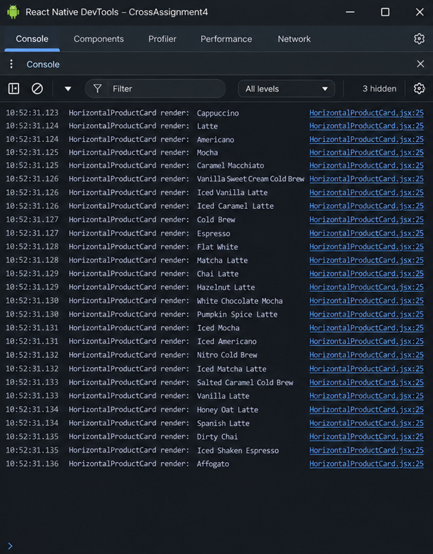
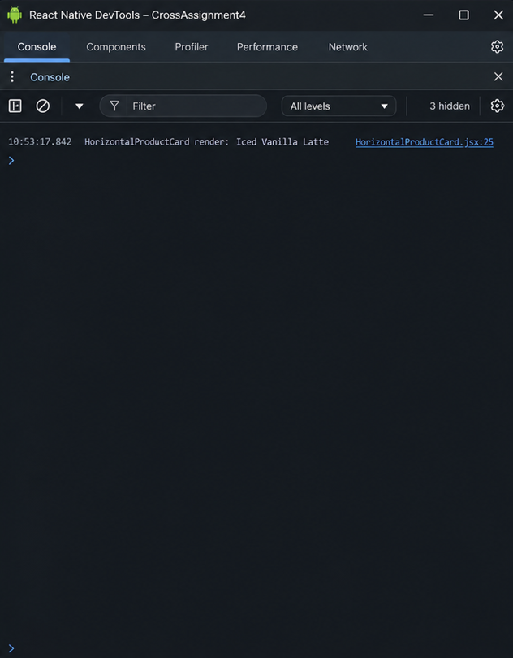
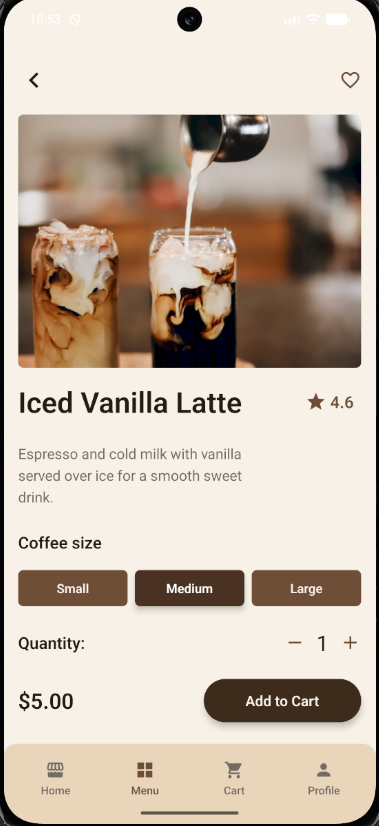
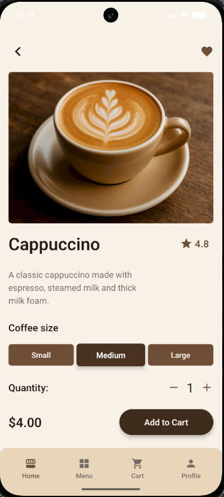
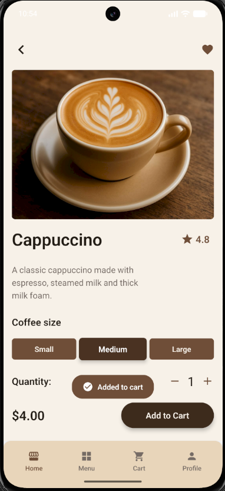
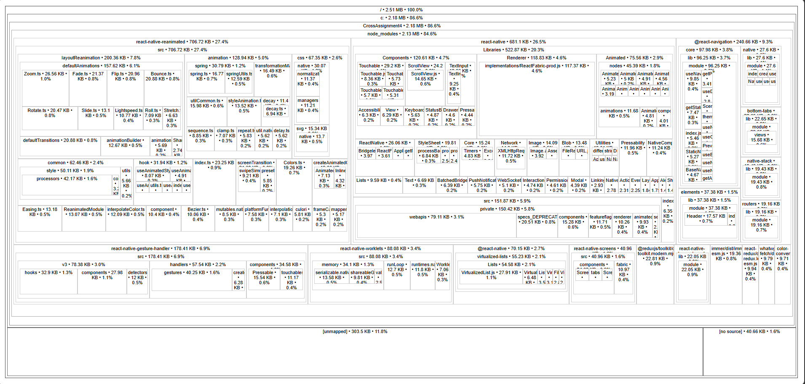

# Cross Assignment 7

## Опис

CoffeeToGo — це мобільний застосунок кав’ярні, створений за допомогою React Native.

Застосунок використовує Stack Navigator, Bottom Tab Navigator та Drawer Navigator для навігації. Дані про напої завантажуються з REST API за допомогою Fetch API та динамічно відображаються в застосунку.

Ця версія проєкту зосереджена на анімаціях, оптимізації продуктивності, оптимізації повторних рендерів, аналізі залежностей та аналізі розміру бандлу.

Застосунок також використовує Context API для зберігання інформації профілю користувача та Redux Toolkit для керування кошиком і улюбленими товарами.

Проєкт містить інтеграцію з REST API, фільтрацію та пошук товарів, керування кошиком, улюбленими товарами, сторінку деталей напою, оформлення замовлення, анімації та оптимізацію продуктивності.

## Глобальний стан

У застосунку використовуються два підходи до керування глобальним станом:

- Context API — дані профілю користувача
- Redux Toolkit — кошик та улюблені товари

### Context API

Інформація профілю користувача керується за допомогою `UserContext`.

Context зберігає:

- ім’я користувача
- email користувача

`UserProvider` огортає застосунок та надає іншим компонентам стан користувача і функцію `updateUser`.

На екрані Profile користувач може змінити інформацію профілю. Оновлене ім’я також відображається на екрані Home.

Це демонструє спільне використання та оновлення глобального стану між різними компонентами.

### Redux Toolkit

Redux Toolkit використовується для керування кошиком та улюбленими товарами.

Redux store містить:

- `cart`
- `favorites`

У застосунку використовуються:

- `configureStore`
- `createSlice`
- `Provider`
- `useSelector`
- `useDispatch`

### Стан кошика

Кошик керується через `cartSlice`.

Доступні операції:

- додавання товару
- видалення товару
- зміна кількості товару
- зміна вибраного розміру напою
- зміна ціни відповідно до вибраного розміру
- розрахунок subtotal, tax та total

Стан кошика використовується спільно на екранах Coffee Details, Cart та Checkout.

### Улюблені товари

Улюблені товари керуються через `favoritesSlice`.

Користувач може:

- додати товар до улюблених
- видалити товар з улюблених
- бачити активний стан улюбленого товару через заповнену іконку серця
- переглядати улюблені товари на екрані Favorites

Стан Favorites синхронізований між екранами:

- Home
- Menu
- Category Products
- Popular Products
- Coffee Details
- Favorites

Екран Favorites доступний через Drawer menu та Profile.

## Структура навігації

У застосунку використовуються:

- Stack Navigator
- Bottom Tab Navigator
- Drawer Navigator

Структура навігації:

```text
Welcome
↓
Drawer Navigator
├── Home
│   └── Bottom Tab Navigator
│       ├── Home Stack
│       │   ├── Home
│       │   ├── Popular Products
│       │   ├── Category Products
│       │   └── Coffee Details
│       ├── Menu Stack
│       │   ├── Menu
│       │   ├── Category Products
│       │   └── Coffee Details
│       ├── Cart Stack
│       │   ├── Cart
│       │   └── Checkout
│       └── Profile
├── Favorites
├── Settings
├── About Us
└── Contact Us
```

## Функціональність

- Welcome screen
- Home screen
- профіль користувача
- редагування імені та email
- глобальний стан користувача через Context API
- меню напоїв
- детальна інформація про напій
- інтеграція з REST API
- завантаження даних з MockAPI
- GET-запити через Fetch API
- відображення товарів через FlatList
- індикатор завантаження
- обробка помилок API
- популярні напої
- фільтрація за категоріями
- пошук товарів
- категорії Hot, Cold та Iced
- навігація до відфільтрованих списків
- навігація до Coffee Details
- віддалені зображення з API
- вибір розміру напою
- різні ціни для Small, Medium та Large
- вибір кількості
- глобальний кошик через Redux Toolkit
- додавання та видалення товарів із кошика
- зміна кількості й розміру товару в кошику
- розрахунок subtotal, tax та total
- керування Favorites через Redux Toolkit
- синхронізація Favorites між екранами
- Checkout
- Bottom Tab navigation
- Drawer navigation
- Stack navigation
- кастомні navigation headers
- іконки навігації
- повернення назад
- Drawer swipe gesture
- передача ID та даних товару між екранами
- анімований вибір розміру через React Native Reanimated
- анімоване повідомлення `Added to cart`
- оптимізація Product Card за допомогою `React.memo`
- оптимізація фільтрації через `useMemo`
- стабільні callback-функції через `useCallback`
- аналіз залежностей через `depcheck`
- аналіз production bundle через `source-map-explorer`

## Інтеграція API

Дані товарів завантажуються з REST API, створеного за допомогою MockAPI.

URL API зберігається у змінній середовища та не додається безпосередньо до Git-репозиторію.

Логіка API знаходиться у:

```text
src/api/api.js
```

GET-запит виконується за допомогою Fetch API:

```js
import { API_URL } from '@env';

export const fetchProducts = async () => {
  const response = await fetch(API_URL);

  if (!response.ok) {
    throw new Error('Failed to fetch products');
  }

  const data = await response.json();

  return data;
};
```

Отримані дані зберігаються у локальному стані компонента через `useState`.

`useEffect` використовується для завантаження товарів під час відкриття відповідного екрана.

## Assignment 7 — Анімація та оптимізація продуктивності

### Завдання 1. Аналіз продуктивності

Застосунок було проаналізовано, щоб визначити компоненти, яким потрібна анімація або оптимізація продуктивності.

- `SizeButton` було вибрано для анімації, оскільки його активний стан змінюється при виборі розміру напою.
- `HorizontalProductCard` було визначено як компонент, який часто повторно рендериться, оскільки він використовується в декількох списках товарів.
- Залежності проєкту та склад production bundle було проаналізовано за допомогою `depcheck` і `source-map-explorer`.

### Завдання 2. Анімація

Анімації реалізовані за допомогою React Native Reanimated.

Компонент `SizeButton` використовує:

- `useSharedValue`
- `useAnimatedStyle`
- `withSpring`

Коли користувач змінює розмір напою, активна кнопка плавно змінює масштаб, надаючи візуальний feedback.

Додатково на екрані Coffee Details реалізовано анімоване повідомлення `Added to cart`.

Для нього використовуються:

- `useSharedValue`
- `useAnimatedStyle`
- `withTiming`

Після додавання товару до кошика повідомлення плавно з’являється та автоматично зникає.

Це забезпечує користувачу миттєвий візуальний feedback без переходу на інший екран.

### Завдання 3. Оптимізація продуктивності

`HorizontalProductCard` було визначено як компонент, який може часто повторно рендеритися через використання в декількох списках товарів.

Компонент було обгорнуто в:

```js
React.memo(HorizontalProductCard)
```

Це запобігає непотрібним повторним рендерам, якщо props компонента не змінилися.

Також було використано:

- `useMemo` для фільтрації товарів
- `useCallback` для стабільної функції Favorites
- `useCallback` для стабільної функції навігації
- стабільне примітивне значення `imageUri` замість створення нового об’єкта зображення під час кожного рендера

Оптимізацію застосовано на екранах:

- Menu
- Popular Products
- Category Products
- Favorites

Для перевірки використовувалося логування в консолі до та після оптимізації.

До оптимізації при оновленні батьківського компонента повторно рендерилися декілька карток товарів.

Після оптимізації картки, props яких не змінилися, більше не виконують зайві повторні рендери.

### Завдання 4. Очищення залежностей та аналіз бандлу

Залежності проєкту були проаналізовані за допомогою `depcheck` та `source-map-explorer`.

Аналіз показав, що серед найбільших runtime-залежностей знаходяться:

- `react-native-reanimated`
- `react-native`
- `@react-navigation`
- `react-native-gesture-handler`

Усі ці залежності активно використовуються застосунком, тому їх було залишено.

Невикористану залежність `@react-native/new-app-screen` було знайдено та видалено з проєкту.

`depcheck` також визначив `react-native-dotenv` як потенційно невикористану залежність. Після ручної перевірки `babel.config.js` було встановлено, що вона необхідна для завантаження URL API з `.env`, тому її було залишено.

У проєкті не було великих utility-бібліотек на зразок `moment` або `lodash`, які можна було б безпечно замінити на легші аналоги. Тому необхідні runtime-залежності були залишені, щоб не вносити непотрібні архітектурні зміни лише заради зменшення розміру бандлу.

### Результати аналізу Bundle

Android production bundle було створено та проаналізовано до і після очищення залежностей за допомогою `source-map-explorer`.

| Показник | До | Після |
| --- | ---: | ---: |
| Bundle size | 2,636,429 bytes | 2,636,733 bytes |
| Приблизний розмір | 2.51 MB | 2.51 MB |

Різниця становить лише 304 bytes, тому фактичний розмір runtime bundle практично не змінився.

Видалена залежність не була імпортована до production JavaScript bundle. Тому її видалення очистило залежності проєкту, але не призвело до вимірюваного зменшення runtime bundle.

Аналіз також підтвердив, що більша частина production bundle складається з необхідних модулів React Native, Reanimated, Navigation та Gesture Handler.

## Технології

- React Native
- JavaScript
- React Navigation
- Native Stack Navigator
- Bottom Tab Navigator
- Drawer Navigator
- Context API
- Redux Toolkit
- React Redux
- Fetch API
- MockAPI
- React Native Vector Icons
- React Native Safe Area Context
- React Native Reanimated
- react-native-dotenv
- source-map-explorer
- depcheck

## Тестування

Застосунок було протестовано на Android emulator.

Перевірено:

- Context API
- оновлення профілю користувача
- Redux store
- додавання та видалення товарів із кошика
- зміна кількості товару
- зміна розміру товару
- розрахунки кошика
- Favorites
- синхронізацію Favorites
- REST API
- loading та error states
- FlatList
- навігацію між екранами
- Bottom Tab
- Drawer
- Stack
- пошук
- фільтрацію категорій
- Popular Products
- віддалені API images
- вибір розміру напою
- анімацію SizeButton
- повідомлення Added to cart
- Checkout
- оптимізацію Product Card
- оптимізацію фільтрації
- аналіз bundle

Проєкт перевірено за допомогою ESLint.

## Скріншоти Assignment 7

### До оптимізації рендерингу



### Після оптимізації рендерингу



### Reanimated Size Selection — Medium



### Reanimated Size Selection — Large



### Анімація Added to Cart



### Аналіз Bundle — до



### Аналіз Bundle — після


## Змінні середовища

Створіть `.env` у корені проєкту:

```env
API_URL=YOUR_MOCKAPI_PRODUCTS_URL
```

Файл `.env` виключений з Git через `.gitignore`.

## Запуск проєкту

Встановлення залежностей:

```bash
npm install
```

Запуск Metro:

```bash
npx react-native start
```

Запуск Android-застосунку:

```bash
npx react-native run-android
```

## Якість коду

Проєкт має модульну структуру.

- Логіка Context API винесена в `UserContext.jsx`.
- Redux-логіка знаходиться в `cartSlice.js` та `favoritesSlice.js`.
- Конфігурація Redux store знаходиться в `store.js`.
- Перевикористовувані UI-компоненти отримують динамічні дані через props.
- Рендеринг списків оптимізований за допомогою `React.memo`, `useMemo` та `useCallback`.
- Спільні значення, наприклад кольори, зберігаються в constants.
- Для інтерактивних UI-анімацій використовується React Native Reanimated.