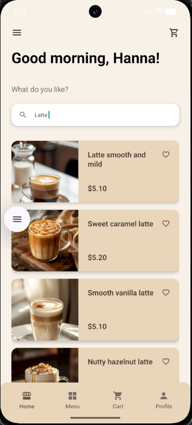
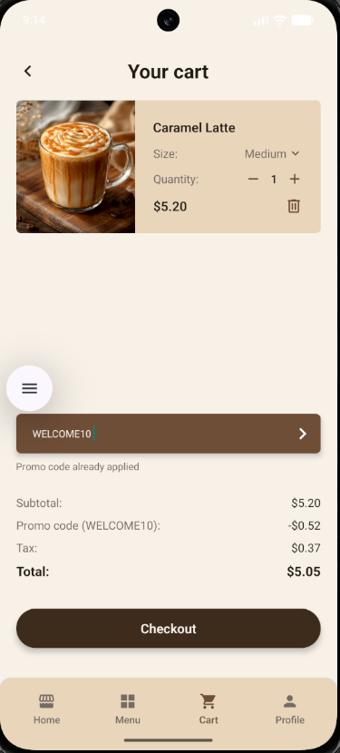
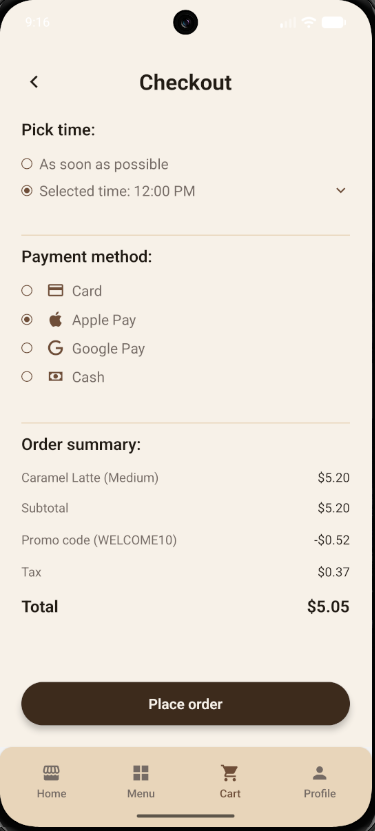
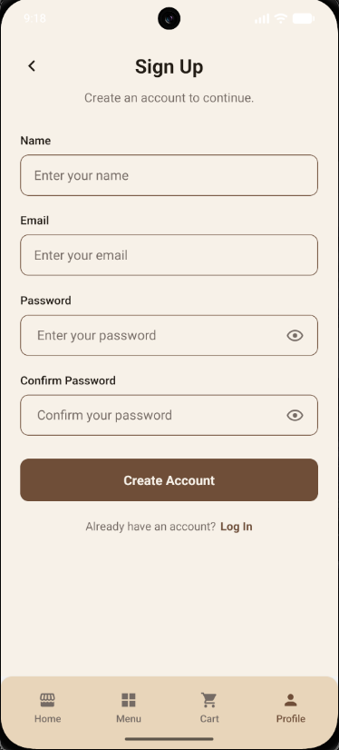
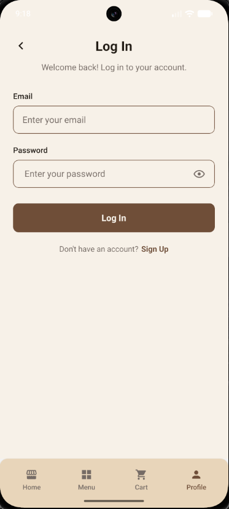
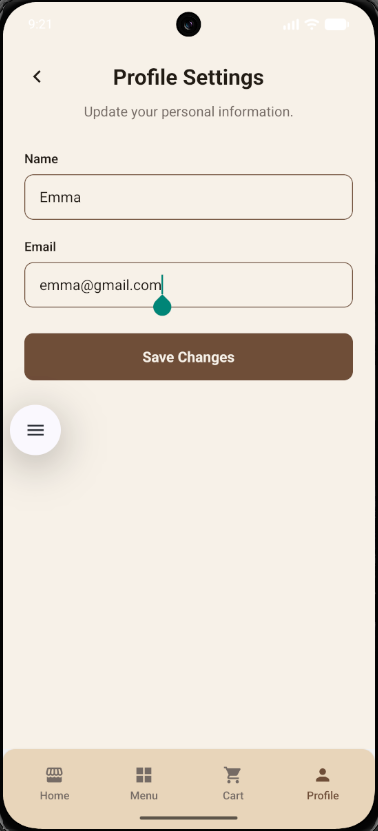
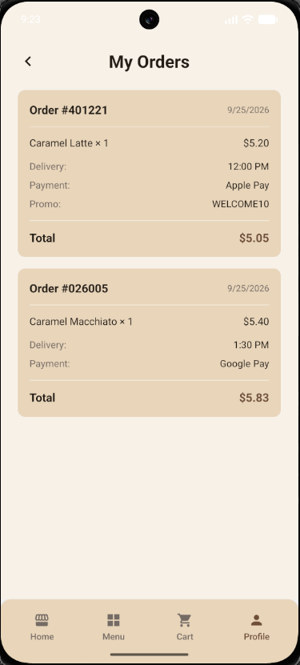
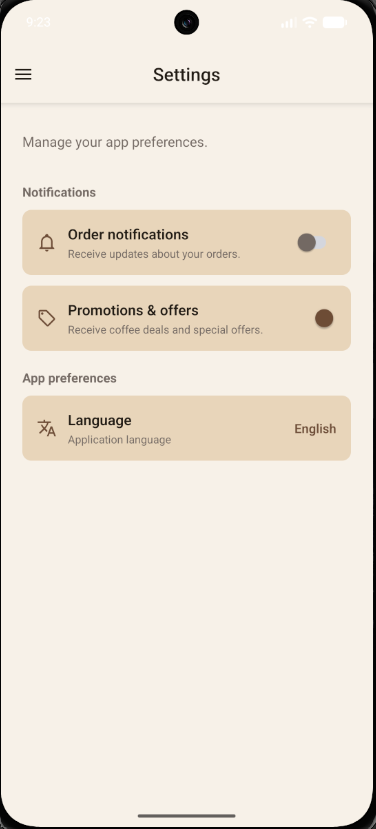
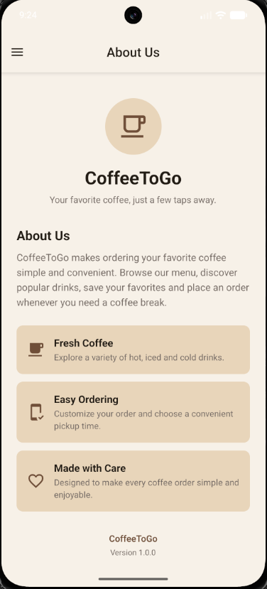
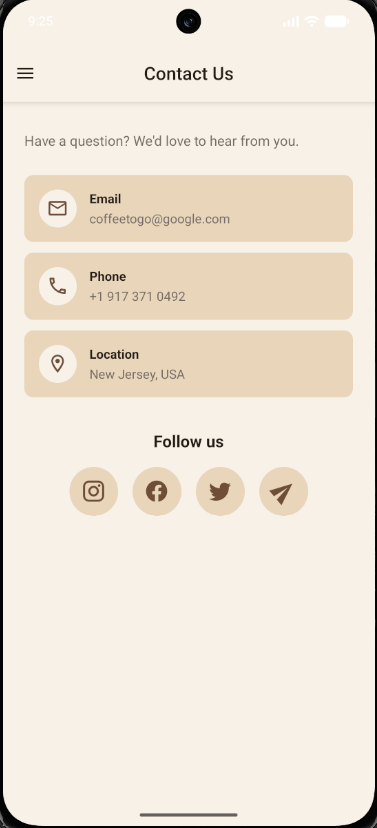

# CoffeeToGo — Фінальний проєкт

## Опис

CoffeeToGo — це мобільний застосунок на React Native для перегляду, вибору та замовлення кавових напоїв.

Застосунок дозволяє користувачам переглядати кавові напої, шукати та фільтрувати їх, переглядати детальну інформацію про продукт, керувати обраними товарами, додавати продукти до кошика, застосовувати промокоди, налаштовувати параметри доставки та оплати, оформлювати замовлення й переглядати історію замовлень.

Проєкт використовує REST API для отримання даних про продукти, React Navigation для навігації застосунком, Context API для стану користувача та авторизації, а Redux Toolkit — для спільного стану застосунку, зокрема кошика, обраного та замовлень.

Цей фінальний проєкт розширює функціональність, розроблену в попередніх завданнях, і зосереджується на створенні повнішого користувацького сценарію, покращенні навігації та UX, а також додаванні нових інтерактивних функцій.

## Покращення фінального проєкту

Існуючий застосунок CoffeeToGo було проаналізовано та розширено в кількох напрямках.

### 1. Процес покупки та оформлення замовлення

Процес оформлення замовлення було розширено такими можливостями:
- Підтримка промокодів
- Розрахунок знижки
- Розрахунок податку після застосування знижки
- Вибір часу доставки
- Опція доставки "As soon as possible"
- Варіанти запланованого часу доставки
- Вибір способу оплати
- Підсумок замовлення
- Підтвердження замовлення
- Автоматичне очищення кошика після успішного замовлення
- Історія замовлень

Доступні способи оплати:
- Card
- Apple Pay
- Google Pay
- Cash

### 2. Профіль користувача та авторизація

Розділ Profile було розширено локальним сценарієм авторизації:
- Sign Up
- Log In
- Log Out
- Profile Settings
- Редагування імені користувача
- Редагування email користувача
- Валідація пароля
- Керування видимістю пароля
- Стани профілю для гостя та авторизованого користувача
- My Favorites
- My Orders

Реалізація авторизації призначена для демонстраційних цілей і зберігає дані облікового запису локально у стані застосунку протягом поточної сесії.

### 3. UX та додаткові розділи застосунку

Було додано кілька покращень, щоб зробити застосунок повнішим і зручнішим у використанні:
- Пошук безпосередньо з екрана Home
- Сортування популярних продуктів за рейтингом
- Покращена взаємодія з Checkout
- Випадаючий список часу доставки
- Settings з інтерактивними перемикачами
- Розширений екран About Us
- Інтерактивний екран Contact Us
- Посилання для email і телефону
- Посилання на соціальні мережі
- Покращена навігація між Cart, Checkout, Home, Profile та Order History

## Основні користувацькі сценарії

### Перегляд і пошук

Користувачі можуть:
- Переглядати категорії кави
- Переглядати популярні продукти
- Шукати продукти з екрана Home
- Фільтрувати продукти за категорією
- Відкривати детальну інформацію про вибраний продукт

### Вибір продукту

На екрані Coffee Details користувачі можуть:
- Переглядати інформацію про продукт
- Вибирати розмір кави
- Змінювати кількість
- Бачити відповідну ціну
- Додавати продукт до кошика
- Додавати продукт до обраного або видаляти його звідти

### Кошик

Користувачі можуть:
- Переглядати продукти в кошику
- Змінювати кількість
- Змінювати розмір продукту
- Видаляти продукти
- Застосовувати промокод
- Переглядати проміжну суму, знижку, податок і загальну суму

Доступні демонстраційні промокоди:
- `WELCOME10` — знижка 10%
- `COFFEE15` — знижка 15%
- `SAVE20` — знижка 20%

### Оформлення замовлення

Користувачі можуть:
- Вибрати "As soon as possible"
- Вибрати запланований час доставки
- Вибрати спосіб оплати
- Переглянути продукти та підсумкову суму замовлення
- Оформити замовлення

Після успішного оформлення замовлення:
- Замовлення додається до Order History
- Кошик очищується
- Користувач повертається на екран Home
- Навігаційний стек Cart скидається

### Історія замовлень

Екран My Orders відображає попередні замовлення з такими даними:
- Продукти
- Кількість
- Варіант доставки
- Спосіб оплати
- Промокод, якщо він був використаний
- Загальна ціна
- Дата замовлення

## Керування станом

Застосунок використовує Context API та Redux Toolkit.

### Context API

`UserContext` is used for user-related state.

Він керує:
- Ім'ям користувача
- Email користувача
- Станом авторизації
- Локальною реєстрацією
- Входом
- Виходом
- Оновленням профілю

Context API було обрано, оскільки обсяг інформації про користувача відносно невеликий і ці дані потрібно використовувати на кількох екранах, зокрема Home, Profile, Login, Sign Up та Profile Settings.

### Redux Toolkit

Redux Toolkit використовується для стану застосунку, який спільно використовується на багатьох екранах і передбачає більшу кількість дій.

Redux store містить:
- `cart`
- `favorites`
- `orders`

#### Стан кошика

Кошик підтримує:
- Додавання продуктів
- Видалення продуктів
- Оновлення кількості
- Оновлення розміру продукту
- Оновлення ціни залежно від розміру
- Застосування промокодів
- Розрахунок знижки
- Розрахунок податку
- Розрахунок загальної суми
- Очищення кошика після замовлення

#### Стан обраного

Продукти можна додавати до обраного або видаляти з нього в різних частинах застосунку.

Стан обраного синхронізується між:
- Home
- Menu
- Category Products
- Popular Products
- Coffee Details
- Обране

#### Стан замовлень

Завершені замовлення зберігаються в Redux store та відображаються на екрані My Orders.

Нові замовлення додаються на початок історії, тому найновіше замовлення відображається першим.

## Структура навігації

Застосунок використовує:
- Native Stack Navigator
- Bottom Tab Navigator
- Drawer Navigator

Структура навігації:

```text
Welcome
 ↓
Drawer Navigator
├── Home
│  └── Bottom Tab Navigator
│    ├── Home Stack
│    │  ├── Home
│    │  ├── Popular Products
│    │  ├── Category Products
│    │  └── Coffee Details
│    │
│    ├── Menu Stack
│    │  ├── Menu
│    │  ├── Category Products
│    │  └── Coffee Details
│    │
│    ├── Cart Stack
│    │  ├── Cart
│    │  └── Checkout
│    │
│    └── Profile Stack
│      ├── Profile
│      ├── Log In
│      ├── Sign Up
│      ├── Profile Settings
│      └── Order History
│
├── Favorites
├── Settings
├── About Us
└── Contact Us
```

Інформація про продукт передається між екранами списків і Coffee Details за допомогою параметрів маршруту навігації.

## Інтеграція REST API

Дані про продукти завантажуються з REST API, наданого MockAPI.

URL API зберігається у змінній середовища та не додається безпосередньо до репозиторію.

Логіку API-запитів винесено в:

```text
src/api/api.js
```

Продукти завантажуються за допомогою Fetch API.

Застосунок містить:
- Інтеграцію REST API
- GET-запити
- Стан завантаження
- Обробку помилок
- Динамічне відображення продуктів
- Віддалені зображення продуктів

Якщо API-запит завершується помилкою, застосунок відображає повідомлення про помилку замість аварійного завершення.

## Основні функції

- Екран Welcome
- Каталог кави
- Завантаження продуктів через REST API
- Пошук продуктів на Home
- Фільтрація продуктів за категоріями
- Популярні продукти
- Детальна інформація про продукт
- Вибір розміру Small, Medium або Large
- Динамічна ціна залежно від вибраного розміру
- Вибір кількості
- Обране
- Кошик
- Промокоди
- Розрахунок знижки
- Розрахунок податку
- Оформлення замовлення
- Вибір часу доставки
- Вибір способу оплати
- Оформлення замовлення
- Історія замовлень
- Sign Up
- Log In
- Log Out
- Profile Settings
- Settings
- About Us
- Contact Us
- Посилання на соціальні мережі
- Stack-навігація
- Bottom Tab-навігація
- Drawer-навігація
- Інтерактивні анімації
- Оптимізація рендерингу

## Покращення UX/UI

Фінальна версія містить кілька UX-покращень:
- Результати пошуку відображаються безпосередньо на екрані Home
- Популярні продукти are ordered by rating
- Стан обраного синхронізується між екранами продуктів
- Вибраний розмір кави має анімований візуальний зворотний зв'язок
- Після додавання продукту до кошика користувач отримує анімований зворотний зв'язок
- Оформлення замовлення provides clear delivery and payment selections
- Запланований час доставки відображається у компактному випадаючому списку
- Некоректні стани Checkout перевіряються перед оформленням замовлення
- Після успішного замовлення користувач повертається на Home, а сценарій Cart скидається
- Гостьові користувачі бачать зрозумілі дії Log In і Sign Up
- Авторизовані користувачі отримують доступ до Profile Settings, Favorites та Orders
- Settings містить інтерактивні налаштування сповіщень
- Опції Contact можуть відкривати зовнішні застосунки для email, телефону та соціальних мереж

## Продуктивність та оптимізація

Покращення продуктивності з попередніх етапів розробки були збережені у фінальному проєкті.

Застосунок використовує:
- `React.memo` for reusable product cards
- `useMemo` for product filtering and derived product lists
- `useCallback` for stable callbacks
- Стабільні примітивні значення URI зображень
- React Native Reanimated для UI-анімацій

`HorizontalProductCard` обгорнуто в `React.memo` для зменшення кількості непотрібних повторних рендерингів, коли його пропси не змінюються.


Залежності проєкту та фінально збірка (production bundle) також були проаналізовані за допомогою `depcheck` і `source-map-explorer`.

## Технології

- React Native
- JavaScript
- React
- React Navigation
- Native Stack Navigator
- Bottom Tab Navigator
- Drawer Navigator
- Context API
- Redux Toolkit
- React Redux
- Fetch API
- MockAPI
- React Native Vector Icons
- React Native Safe Area Context
- React Native Reanimated
- react-native-dotenv

## Тестування

Застосунок було протестовано вручну на Android-емуляторі.

Було перевірено таку функціональність:
- Завантаження продуктів через REST API
- Стани завантаження та помилки
- Пошук на Home
- Фільтрація продуктів за категоріями
- Сортування популярних продуктів
- Детальна інформація про продукт
- Вибір розміру кави
- Вибір кількості
- Обране synchronization
- Додавання продуктів to the cart
- Видалення продуктів from the cart
- Оновлення кількості продукту
- Оновлення розміру продукту
- Застосування промокоду
- Розрахунок знижки
- Розрахунок податку та загальної суми
- Оформлення замовлення navigation
- Вибір часу доставки
- Валідація часу доставки
- Вибір способу оплати
- Оформлення замовлення
- Cart clearing after successful orders
- Cart navigation reset after checkout
- Історія замовлень
- Sign Up
- Log In
- Валідація неправильних даних для входу
- Log Out
- Profile Settings
- Оновлена інформація користувача після входу
- Перемикачі Settings
- Екран About Us
- Посилання Contact
- Bottom Tab-навігація
- Drawer-навігація
- Stack-навігація
- Навігація назад

Проєкт також було перевірено за допомогою ESLint — помилок і попереджень не виявлено.

## Скріншоти

### Welcome


### Home


### Пошук на Home

Результати пошуку відображаються безпосередньо на екрані Home.



### Деталі продукту


### Favorites


### Кошик із промокодом

Кошик підтримує промокоди та динамічно перераховує знижку, податок і загальну суму.



### Оформлення замовлення

Перед оформленням замовлення користувачі можуть вибрати час доставки та спосіб оплати.



### Sign Up



### Log In



### Profile


### Profile Settings



### Історія замовлень



### Settings



### About Us



### Contact Us



## Змінні середовища

Створіть файл `.env` у кореневій папці проекту:

```env
API_URL=YOUR_MOCKAPI_PRODUCTS_URL
```

Файл `.env` виключено з Git за допомогою `.gitignore`.

## Запуск проєкту

Встановіть залежності:

```bash
npm install
```

Створіть файл `.env` у корені проекту:

```env
API_URL=YOUR_MOCKAPI_PRODUCTS_URL
```

Запустіть Metro:

```bash
npx react-native start
```

В іншому терміналі запустіть Android-застосунок:

```bash
npx react-native run-android
```

## Структура проєкту

```text
src/
├── api/
├── assets/
├── components/
├── constants/
├── context/
├── navigation/
├── redux/
└── screens/
```

Проєкт має модульну структуру:
- Повторно використовувані UI-елементи винесено в компоненти
- Компоненти екранів відокремлено від повторно використовуваних компонентів
- Конфігурацію навігації винесено в окремі файли navigator
- Логіку Redux розділено на slices
- Стан користувача винесено в Context
- Логіку API-запитів відокремлено від UI-компонентів
- Спільні кольори та назви екранів зберігаються в constants

## Демонстраційне відео

Коротке демонстраційне відео показує основний користувацький сценарій CoffeeToGo, зокрема пошук продуктів, обране, кошик, промокоди, Checkout, історію замовлень, керування профілем і додаткові екрани застосунку.

[Переглянути демонстраційне відео](./demo/CoffeeToGo_Final_Project_Demo.mp4)

## Презентація проєкту

[Презентація фінального проєкту — PDF](./presentation/CoffeeToGo_Final_Project.pdf)

## Якість коду

- Модульна структура компонентів
- Повторно використовувані компоненти
- Централізовані константи
- Відокремлена логіка API
- Керування глобальним станом за допомогою Redux Toolkit і Context API
- Render optimization with React hooks and `React.memo`
- Інтерактивні анімації with React Native Reanimated
- Перевірка ESLint завершена без помилок і попереджень

## Фінальний результат

CoffeeToGo демонструє повний сценарій роботи мобільного застосунку на React Native, включаючи інтеграцію REST API, навігацію, керування глобальним станом, взаємодію з користувачем, функціональність кошика, Checkout, локальну авторизацію, історію замовлень, анімації та оптимізацію продуктивності.

Фінальний проєкт розширює початковий застосунок додатковою функціональністю, зберігаючи код організованим у повторно використовувані та зручні для підтримки модулі.